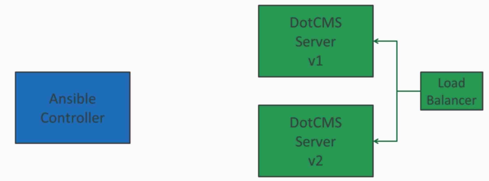

# What is DevOps good for    


## more reliable software      


## build it so it stays running      


## Idempotence    

Idempotence is about safety in an uncertain world


idempotent
adjective UK ​  /ˌɪd.əmˈpəʊ.tənt/ US ​  /ˌaɪ.demˈpoʊ.t̬ənt/ specialized
​
An idempotent element of a set does not change in value when multiplied by itself.


## immutable infrastructure   

Immutable infrastructure allows consistent, zero-downtime upgrades    

```
In Immutable infrastructure,  We never grade, we replace
```



