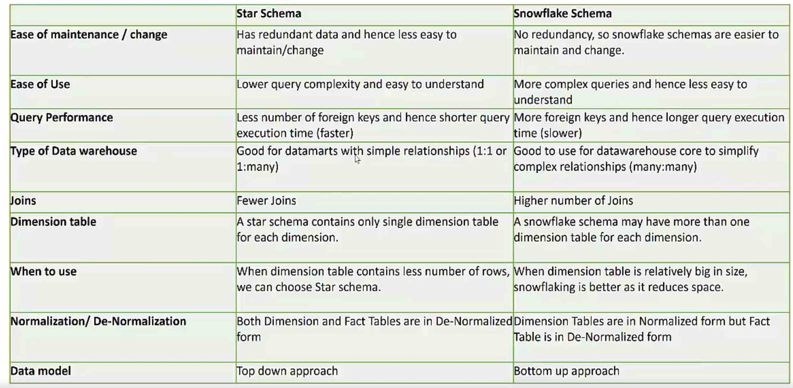

Dimensional Model    

# what is dimension modelling?  

A dimensional Model is a database structure that is optimized for online queries and data warehousing tools.  

It is comprised of "fact" and "dimension" tables.

A "fact" is a numeric value that a business wishes to count or sum. 

A "dimension" is essentially an entry point for getting at the facts.

# benefits of Dimensional Modeling   

```
fater data retrieval
better understandability
extensibility
```

# what is a dimension?   

a dimension is a collection of reference information about a measurable event. 

The primary function of dimension is **Filtering, Grouping and Labelling**

# what is a fact?   

Fact contains fundamental measurement of the data warehouse.     

# additive facts   

```
additive facts -- measures that can be added across all dimensions
non additive facts -- measures that cannot be added across all dimensions
semi additive facts --  measures that can be added across few dimensions and not with others
```

The numeric measures in a fact table fall into three categories. The most flexible and useful facts are fully additive; additive measures can be summed across any of the dimensions associated with the fact table. 

An example of a fully additive measure is sales (purchases from a store). You can add hourly sales to get the sales for a day, week, month, quarter, or year. You can add sales across stores or regions.

# semi additive facts   
Semi-additive measures can be summed across some dimensions, but not all; balance amounts are common semi-additive facts because they are additive across all dimensions except time. Finally, some measures are completely non-additive, such as ratios.

Semi-additive measures can be summed across some dimensions, but not all; checking account or savings account balance amounts are common semi-additive facts.

You can recreate a balance amount from the transactions file, but it doesn't make any sense to add the balance amounts from October, November, and December (across the time dimension).

# non additive facts

Finally, some measures are completely non-additive, such as ratios. A good approach for non-additive facts is, where possible, to store the fully additive components of the non-additive measure and sum these components into the final answer set.

# factlss facts    

don't contain measurable attributes at all   

# what is surrogate key   

A surrogate key is any column or set of columns that can be declared as the primary key instead of a "real" or natural key. Sometimes there can be several natural keys that could be declared as the primary key, and these are all called candidate keys. So a surrogate is a candidate key.

# star schema  

```
types of schema
1 star schema
2 snowflake schema
3 galaxy schema/fact constellations
```

Star schema
```
In computing, the star schema is the simplest style of data mart schema and is the approach most widely used to develop data warehouses and dimensional data marts. The star schema consists of one or more fact tables referencing any number of dimension tables.

1 simple structure
2 great query effectiveness
3 processing time
```

# snowflake schema    

snowflake is like an extension of the star schema

```
In computing, a snowflake schema is a logical arrangement of tables in a multidimensional database such that the entity relationship diagram resembles a snowflake shape. The snowflake schema is represented by centralized fact tables which are connected to multiple dimensions..
```

```
Snowflake schemas will use less space to store dimension tables. This is because as a rule any normalized database produces far fewer redundant records .
Denormalized data models increase the chances of data integrity problems. These issues will complicate future modifications and maintenance as well.
To experienced data modelers, the snowflake schema seems more logically organized than the star schema. (This is my personal opinion, not a hard fact. :) )
```

# Galaxy/fact constellation schema    

Fact constellation is a measure of online analytical processing, which is a collection of multiple fact tables sharing dimension tables, viewed as a collection of stars. It can be seen as an extension of the star schema. A fact constellation schema has multiple fact tables. It is also known as galaxy schema.

# types of schema

