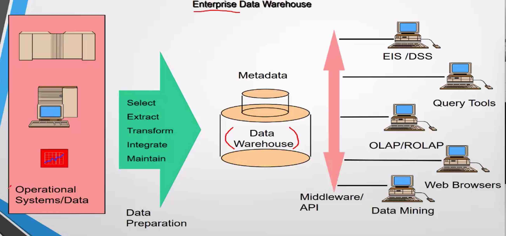

Business Intelligence    

## enterprise architecture(Centralized Architecture)    



## Single Department Data Mart(Federated Architecture)   


## multi-tierLayerArchitecture(tiered Architecture)   


## components of a Data Warehouse     

```
1 Source(s)     (like OS--oltp, flat files, relational db) 
2 data extraction/transformation/load (ETL) tool    
3 Data warehouse maintenance and administration tools
4 Data modeling tool or interface to external data models(Physical model (PDM) and logical model (LDM) )
5 Warehouse databases
6 End-user data access and analysis tools  
```

MDDB = multidimensional database


## purpose of a staging area in Data warehouse architecture     

staging area:  temporary area     

A staging area, or landing zone, is an intermediate storage area used for data processing during the extract, transform and load (ETL) process. The data staging area sits between the data source(s) and the data target(s), which are often data warehouses, data marts, or other data repositories.


## benefits of data warehouses    
```
single point of data storage
quick and easy access to data
data quality and consistency 
better decision-making
better data visualization and analytics

```

## limitations of Traditional data warehouses     

```
1 major data shcema transforms from each of the data sources to one schema in the data warehouse, which can represent more than 50% of the total data warehouse effort  
2 Data owners lose control over their data, raising ownership (responsibility and accountability), security and privacy issues   
3 long initial implementation time and associated high cost
4 adding new data sources takes time and associated high cost
5 limited flexibility of use and types of users - requires multiple separate data marts for multiple uses and types of users
6 typically, data is static and dated
7 typically, no data drill-down capabilityes
8 difficult to accommodate changes in data types and ranges, data source schema, indexes and queries
9 typically, cannot actively monitor changes in data

```


