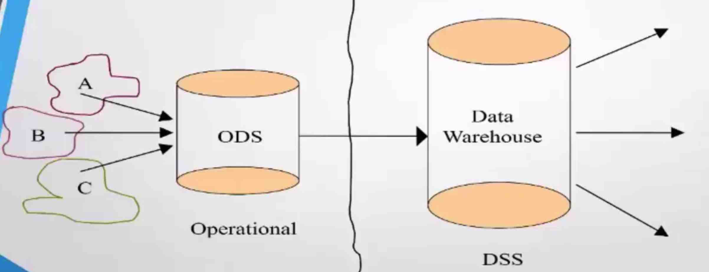
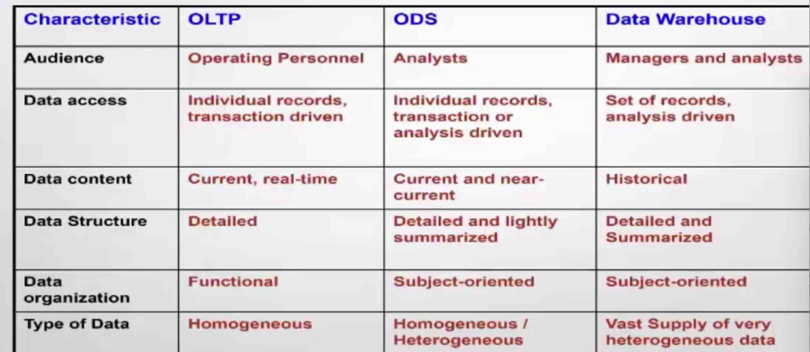

Operational Data Store   

# what is ODS     

  
(A, B, C are different data sources)

Operational Data Store   
```
An operational data store (ODS) is an alternative to having operational decision support system (DSS) applications access data directly from the database that supports transaction processing (TP).

The purpose of an ODS is to integrate corporate data from different heterogeneous data sources in order to facilitate operational reporting in real-time or near real-time .  Usually data in the ODS will be structured similar to the source systems, although during integration the data can be cleaned, denormalized, and business rules applied to ensure data integrity.  This integration will happen at the lowest granular level and occur quite frequently throughout the day.  Normally an ODS will not be optimized for historical and trend analysis as this is left to the data warehouse.  And an ODS is frequently used as a data source for the data warehouse.

```


# Define ODS   

A subject oriented, integrated, volatile, current valued data store containing only corporate detailed data


# Features and Benefits of ODS

```
The ODS applies only to the world of operational systems
The ODS contains current valued and near current valued data
The ODS contains almost exclusively all detail data
The ODS requires a full function, update, record oriented environment
```

# functions of an ODS

```
Converts Data
Decides which data of multiple Sources is the best
decodes/encodes Data
Alters the Key structures
Alters the physical Structures
Reformats Data
Internally represents Data
Recalculates Data
```

# Differences between ODS, DWH, OLTP, OLAP, DSS

```
current(OLTP)                    is this medicine available in stock now      

recent(ODS)                      what are the tests this patient has completed in the recent past

historical(Data Warehouse)       Has the incidence of Tuberculosis increated in last 5 years in Southern region

```

  


