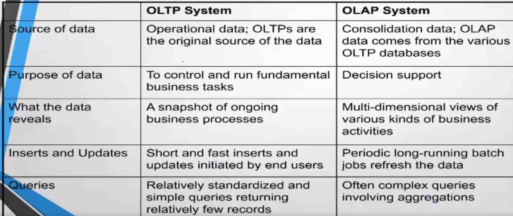
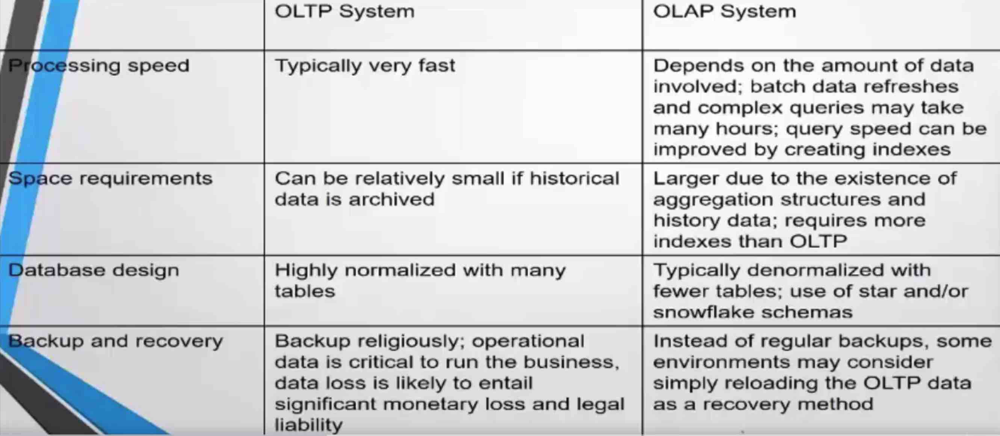
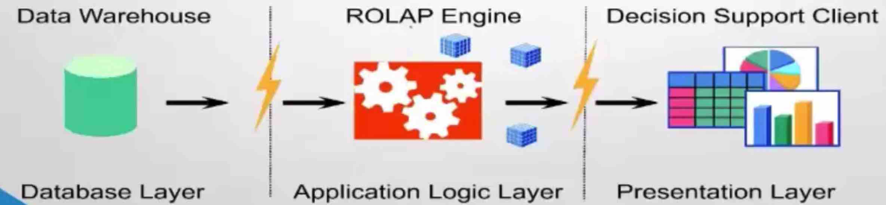
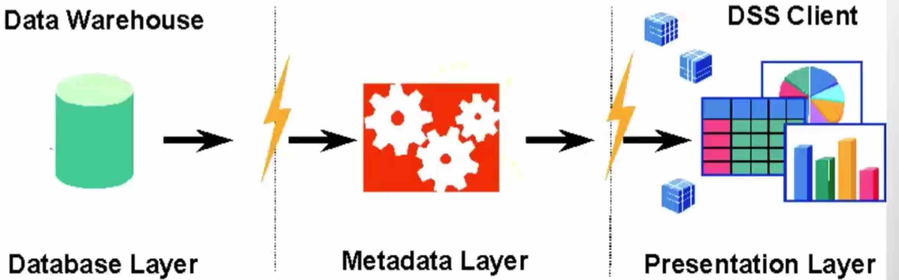

OLAP Overview


# OLAP Overview     

OLAP - On Line Analytical Processing   
```
Fast Analysis of Multidimensional information
```

OAP is a category of technology that enables users to gain insight into their data in a fast, interactive and easy to use manner   

OLAP provides the following 3 features
```
Multidimensional viewing Capabilities - Browsing and Navigation (Slice and dice)
Calculation Intensive Capabilities
Time Intelligence - Time Series analysis
```

# OLAP vs OLTP    


OLTPvsOLAP

OLTPvsOLAP2




# OLAP architecture   

## MOLAP - multidimensional OLAP    

```
Data is stored in multidimensional cubes
MDDB technology is proprietary 
Compilation intensive architecture
Load involves series of aggregations across orthogonal dimensions
Good to access pre-aggregated data
```

advantages
```
intuitive
performance advantages
ease of navigation
little performance tuning required
```

Disadvantages
```
proprietary
no standard storage techniques
aggregate explosion problem
l;mited to 50-100 GB of calculated data(can increase when new technologies)
```

## ROLAP - relational OLAP    

```
Support for large databases with good performance
excellent platform portability
good exploitation of hardware advances such as parallel processing  
Codd rules however are not concerned about storage, but about functionality only
```


ROLAPArchitecture


advantages
```
Robust security
multi-user concurrent access(e.g. read-write writh locking)
widely recognized standards
openness to multiple tools
based on familar, proven and scalable technology
- extraction & replication
- Parallelization
- Query Optimization
- Advanced Indexing techniques
```

Disadvantages
```
- computation Intensive queries are slow 
- additional layer of OLAP engine
- non intuitive
```

## HOLAP - Hybrid OLAP    

Hybrid = MOLAP + ROLAP   


## DOLAP - Desktop OLAP    

Desktop OLAP tools work by extracting RDBMS data into local (or server) MD cubes




