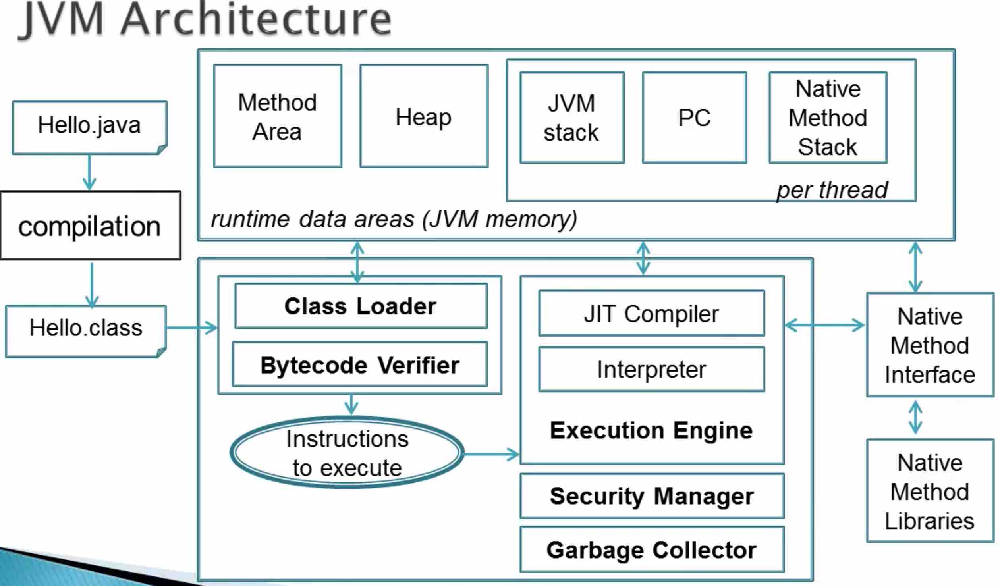

platform independent
```
java bytecode   
```
scala, ruby can also be compiled to java bytecode   

## JVM   

1 abstract computing machine    

2 Core responsibility

```
Loading & interpreting bytecode
Security
Automatic memory management
```

Specification & Implementation
```
Abstract JVM specification
JLS - java language specificaiton

Concrete implementation
   Oracle's HotSpot JVM
   IBM's JVM

Runtime instance

```

3 Performance   

```
1 Bytecode interpretation is much faster
    Java bytecode is compact, compiled and optimized
2 Just-in-time (JIT) compilation 
  Identity frequently executed bytecode ~ "hot spots"  
  JIT compiler converts "hot spots" to machine code
  Cache machine code
  Cached machine code -> faster execution
  also called dynamic compilation
```

JIT Compilation Example
```java
foo() {        // JIT Compiler -- Optimized Machine Code (cached) as it will be called 1000 times
	...
}

bar() {        // Java Interpreter - machine code -- Optimized as it will be called 2000 times
	...
}

```

JIT--compiling byte code into native machine code at run time
```
The Just-In-Time (JIT) compiler is a component of the Java Runtime Environment that improves the performance of Java applications at run time. Java programs consists of classes, which contain platform neutral bytecode that can be interpreted by a JVM on many different computer architectures. At run time, the JVM loads the class files, determines the semantics of each individual bytecode, and performs the appropriate computation. The additional processor and memory usage during interpretation means that a Java application performs more slowly than a native application. The JIT compiler helps improve the performance of Java programs by compiling bytecode into native machine code at run time. 
```

**JVM Architecture**   




