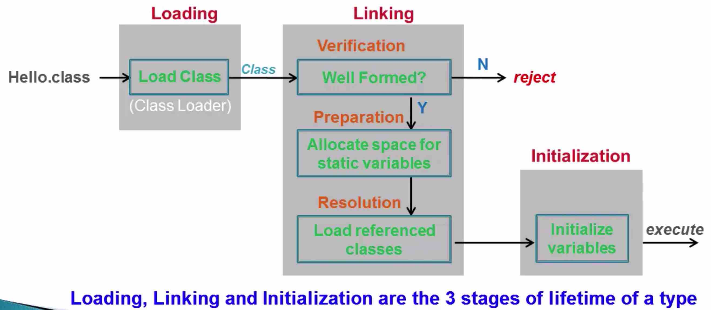

**Life time of a type**

# Life time of a type : motivation   

```java
class Superclass {
  Superclass() {
    System.out.println("Superclass: constructor");
  }
}

class Subclass extends Superclass {
  static final int STATIC_FINAL = 47; // COMPILE-TIME sonstant
  static final int STATIC_FINAL2 = (int) (Math.random() * 5);
  static { System.out.println("Subclass: static initializer"); }
  Subclass() {
    System.out.println("Subclass: constructor");
  }
}

public class ClassInitializationDemo {
  static { System.out.println("ClassInitializationDemo: static initializer");}
  {
    System.out.println("ClassInitializationDemo: instance initializer");
  }
  public static void main(String[] args) {
    System.out.println("Subclass.STATIC_FINAL:" + Subclass.STATIC_FINAL);
    System.out.println("Subclass.STATIC_final2:" + Subclass.STATIC_FINAL2);
    new Subclass();
  }
}


```

# An overview of Lifetime of a Type   

Hello.class -> load Class -> Well Formed?(check the class) -> N -> reject 
                                    |
                                    |
                                    Yes--> allocate space for static variables -> load referenced classes -> initialzie variables -> execute





Interface Initialization:

```
 Static method is accessed
 Field initialized via method
```

