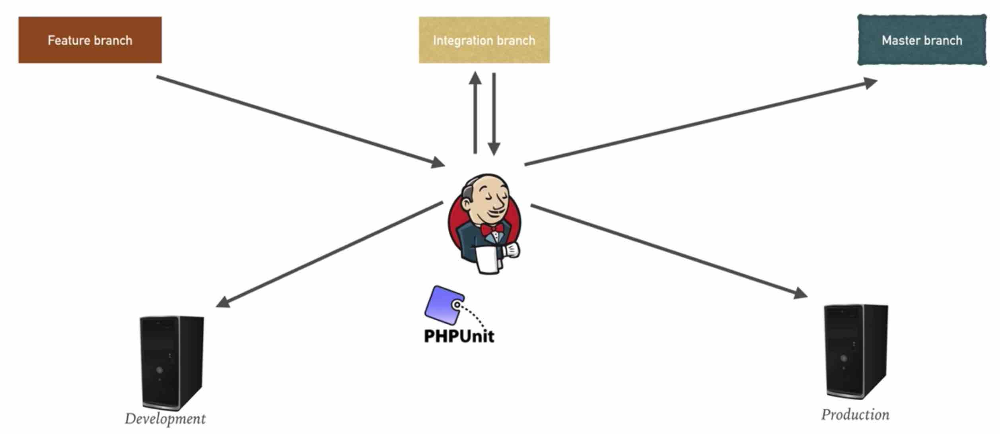

The project map   


# The project map       

## The project map    

This project is a web-based booking application. It contains the following components:       
```
Environment          Number of machines                                   Purpose
Client                  1                                    Mimics the developer machine used to write the application code. Also used for running Ansible against the other environment    

Testing                 2                                    The application server hosting the web application and the database server hosting the backend database

Production              2                                    The application server, the database server
```

## the tools that are used    

```sh
Vagrant for infrastructure provisioning
Ansible for configuration management
Git for version control, GitHub as a central repository
Jenkins as a CI/CD tool
```


## the project branches, environments, unit tests   
```
Three environments:
Feature branch
integration branch
master branch

Two environments:
Development
Production

Unit testing

```



# Lab - Vagrant, Jenkins, Infra, Unit testing, CI, CD    

## Lab1 - Firing up Vagrant       

```sh
vagrant status
cd project
vagrant up web db
```
then we navigate to web by
```sh
vagrant ssh web

```
then we navigate to db by
```sh
vagrant ssh db
mysql -u root -padmin

MariaDB [(none)]> use ci_database  

```


## Lab2 - Installing Jenkins   

```sh
vagrant up jenkins

or
vagrant provision jenkins

navigate to 192.168.33.40:8080

vagrant ssh jenkins
sudo cat /var/lib/jenkins/secrets/initialAdminPassword   # to see the passwd  

use UI to install the following plugins:
1 github plugin
2 ssh plugin
3 ssh agent plugin

```


```sh
vagrant ssh 192.168.33.40
# then install phpunit
sudo pear upgrade pear

sudo pear channel-discover pear.phpunit.de
sudo pear channel-discover pear.symfony-project.com
sudo pear channel-discover pear.symfony.com
sudo pear channel-discover components.ez.no

sudo pear install --alldeps phpunit/PHPUnit

phpunit
```


## Lab3 - Deploying Infrastructure   


## Lab4 - Unit Testing     


## Lab5 - Integration Job     


## Lab6 - Continuous Delivery     


## Lab7 - Continuous Deployment     


# Abbreviations         

EPEL ---- Extra Packages for Enterprise Linux (EPEL). 

CodeIgniter ---- an open-source software rapid development web framework, for use in building dynamic web sites with PHP.

MariaDB ---- Here it is used as a MySql client.   
MariaDB is a community-developed, commercially supported fork of the MySQL relational database management system, intended to remain free and open-source software under the GNU GPL. Development is led by some of the original developers of MySQL, who forked it due to concerns over its acquisition by Oracle Corporation