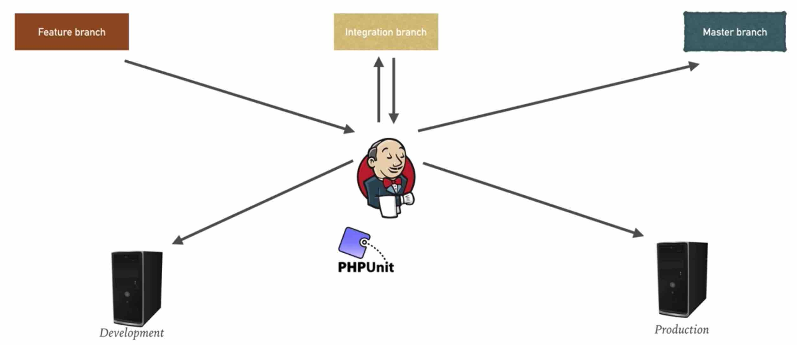

The project map   


# The project map       

## The project map    

This project is a web-based booking application. It contains the following components:       
```
Environment          Number of machines                                   Purpose
Client                  1                                    Mimics the developer machine used to write the application code. Also used for running Ansible against the other environment    

Testing                 2                                    The application server hosting the web application and the database server hosting the backend database

Production              2                                    The application server, the database server
```

## the tools that are used    

```sh
Vagrant for infrastructure provisioning
Ansible for configuration management
Git for version control, GitHub as a central repository
Jenkins as a CI/CD tool
```


## the project branches, environments, unit tests   
```
Three environments:
Feature branch
integration branch
master branch

Two environments:
Development
Production

Unit testing

```



# Lab - Vagrant, Jenkins, Infra, Unit testing, CI, CD    

## Lab1 - Firing up Vagrant       

```sh
vagrant status
cd project
vagrant up web db
```
then we navigate to web by
```sh
vagrant ssh web

```
then we navigate to db by
```sh
vagrant ssh db
mysql -u root -padmin

MariaDB [(none)]> use ci_database  

```


## Lab2 - Installing Jenkins   

```sh
vagrant up jenkins

or
vagrant provision jenkins

navigate to 192.168.33.40:8080

vagrant ssh jenkins
sudo cat /var/lib/jenkins/secrets/initialAdminPassword   # to see the passwd  

use UI to install the following plugins:
1 github plugin
2 ssh plugin
3 ssh agent plugin

```

install junit   
```sh
vagrant ssh 192.168.33.40
# then install phpunit

wget https://phar.phpunit.de/phpunit-6.5.phar
chmod +x phpunit-6.5.phar
sudo mv phpunit-6.5.phar /usr/local/bin/phpunit
phpunit --version
```


## Lab3 - Deploying Infrastructure   

```sh
vagrant up client  
vagrant ssh client
git clone https://github.com/Marathon-fan/VagrantJenkinsUnitTestingCICD.git
cd VagrantJenkinsUnitTestingCICD/
cd application/tests      # uses github.com/kenjis/ci-phpunit-test

```

## Lab4 - Unit Testing     

create a new job using Jenkins   
```sh
navigate to 192.168.33.40:8080
create a new job-> enter an item name->
set the name to be:
"project_feature_test"

choose freeStyleProject

SourceCodeManagement-> choose Git
Repository URL: https://github.com/Marathon-fan/VagrantJenkinsUnitTestingCICD
Credentials: none
Branch Specifier (blank for 'any'): */feature
Build Triggers: Poll SCM
Schedule: 0 * * * *

Build: add Execute shell-> Command: (using the following cmds)
"cd application/tests
/usr/local/bin/phpunit"


```

## Lab5 - Integration Job     

When unit testing passed in the feature branch, it will automatically be pushed into integration branch
```sh
create a new item called integration_branch 

choose it as freeStyleProject

SourceCodeManagement-> choose Git
Repository URL: https://github.com/Marathon-fan/VagrantJenkinsUnitTestingCICD
add Credentials-- userName, passwd, then add this Credential

Branch Specifier (blank for 'any'): */feature
Build Triggers: Poll SCM
Schedule: 0 * * * *

Build Triggers
Build after other projects are built
project to watch: project_feature_test

Build: add Execute shell 1-> Command: (using the following cmds)
"cd application/tests
phpunit         # assume we will run integration test
"

Build: add Execute shell 2-> Command: (using the following cmds)
"git checkout feature
git pull
git checkout integration
git merge feature
"

Post-build Actions:
Git Publisher
  tick "Push Only If Build Succeeds"
    Branches:
      Branch to push: integration
      Target remote name: origin
```

## Lab6 - Continuous Delivery     

After the unit testing and integration testing succeed, deploy the changes to testing environment(UAT)    

```sh
vagrant up webdev

then navigate to http://192.168.33.25/
```

configure Continuous Delivery   
```sh
in Jenkins dashboard, 

create a new item called feature_delivery

choose it as freeStyleProject

SourceCodeManagement-> choose Git
Repository URL: https://github.com/Marathon-fan/VagrantJenkinsUnitTestingCICD
Credentials(none)  # as we will not push changes to github

Build Triggers--
Build after other projects are built
project to watch: integration_branch    # after the job integration_branch succeeds, 

Build--
Execute shell script on remote host using ssh
SSH site: vagrant@192.168.33.25:22  (dashboard-> manage jenkins -> configure system -> ssh remote hosts -> SSH sites: hostname: 192.168.33.25(the host for developers), port:22, Credentials: (add it: the userName:Vagrant, passwd: vagrant), then use this credential vagrant, , also add SSH sites: hostname: 192.168.33.20(the host for developers), port:22, Credentials: vagrant)

Command: 
"
cd /var/www/html/CodeIgniter-3.1.5/
git checkout integration
git pull
"

```

```sh 
vagrant ssh client
make some changes to the code
git add *
git commit to feature branch

if everything succeeds, then the changes will be seen in dev server
```


## Lab7 - Continuous Deployment     
**integrate the changes to the master branch, and deploy the item to production env**

create job1-----

```sh
in Jenkins dashboard, 

create a new item called feature_master_integration      # integrate the code to master branch if all the builds and tests succeed   

choose it as freeStyleProject

SourceCodeManagement-> choose Git
Repository URL: https://github.com/Marathon-fan/VagrantJenkinsUnitTestingCICD
Credentials: use the credential so that we can push changes to the master branch
Branch Specifier (blank for 'any'): */integration


Build Triggers--
Build after other projects are built
project to watch: feature_delivery    # after the job feature_delivery succeeds, then we try to trigger this job(item)
         tick: Tigger only if build is stable

Build--
Execute shell 1  
Command:
"
cd application/tests
phpunit        # test this first
"   

Execute shell 2
Command:
"
git checkout integration
git pull
git checkout master
git merge integration
"   

Post-build Actions--
  Git Publisher:   
     tick "Push Only if Build Succeeds"
     Branches: 
       Branch to push: master
       Target remote name: origin

```

create job2-----

```sh
in Jenkins dashboard, 

create a new item called project_deployment      # integrate the code to master branch if all the builds and tests succeed   

copy from feature_delivery  # as this is pretty similar to that job, we copy it and make minor changes

SourceCodeManagement
  branches to build:  "*/master"

Build Triggers--
Build after other projects are built
project to watch: feature_master_integration   
  tick "Trigger only if builds is stable"
Execute shell script on remote host using ssh:
  SSH site: vagrant@192.168.33.25:22    (the production host)
    

Command: 
"
cd /var/www/html/CodeIgniter-3.1.5/
git checkout integration
git pull
"

```


# Abbreviations         

EPEL ---- Extra Packages for Enterprise Linux (EPEL). 

CodeIgniter ---- an open-source software rapid development web framework, for use in building dynamic web sites with PHP.

MariaDB ---- Here it is used as a MySql client.   
MariaDB is a community-developed, commercially supported fork of the MySQL relational database management system, intended to remain free and open-source software under the GNU GPL. Development is led by some of the original developers of MySQL, who forked it due to concerns over its acquisition by Oracle Corporation

SCM ---- Software Configuration Management. Subversion, CVS, Perforce, ClearCase, Git    