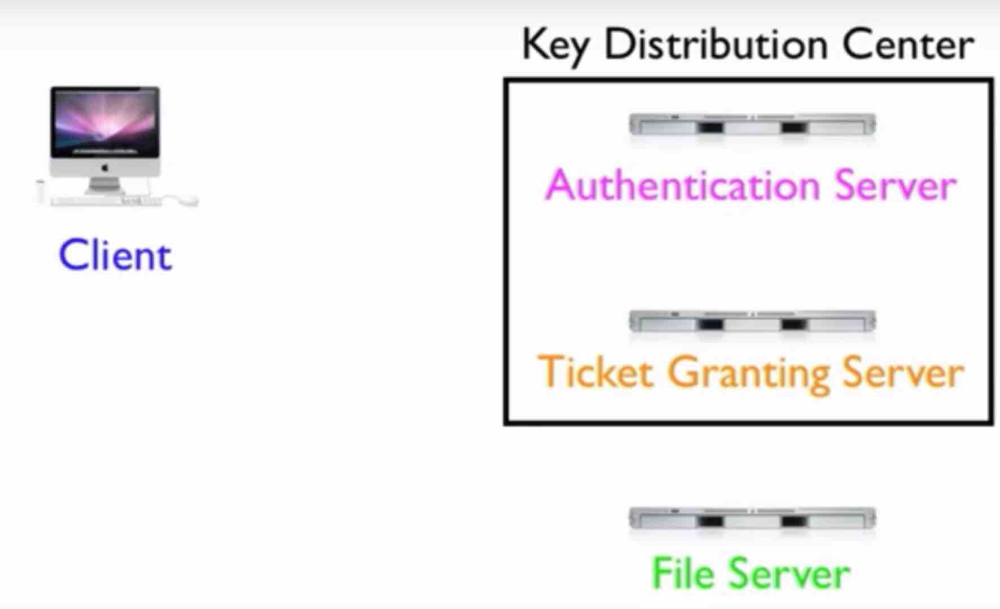

# Authentication with Kerberos

```
1 what is Kerberos
2 how to install Kerberos
3 how to configure Kerberos in cloudera cluster
4 how to work with kerberos cluster
```

**TGT**: Ticket Granting  ticket  

**TGS**: Ticket Granting Service   

**KDC**: Key Distribution Center   

**SPN**: Service Principal Name   

**AS**: Authentication Server  

**FS**: File Server

# Kerberos porcess



## step 1    
```
client gen client secret key using its userName and passwd 
client send userName and passwd to AS

In some implementation, this step is like: the client sends its userName and some other information to AS(this information is partially encrypted with the clients passwd)
In this way, even the first step is with a shared session key(between AS and client) 
```

## step 2    
```
AS checks if the user is in the database
AS gen client secret key using its userName and passwd 

AS send A back to client
AS send B back to client

A is Client/TGS session key(encrypted with client secret key)
B is Ticket Granting ticket includes Client ID, client network address, ticket validity period and Client/TGS session key(encrypted with TGS secret key)

```

## step 3    
```
Client decodes A using its secret key, and obtains Client/TGS session key
Client cann't decode B as it doesn't have TGS secret key
```

## step 4    
```
Client sends C to TGS
Client sends D to TGS

C is  B + File service ID(as the client asks for file service) 
D is Authenticator composed of Client ID and timestamp(encrypted with Client/TGS session key from A)
```

## step 5    
```
TGS decrypts C and gets Ticket Granting Ticket(which includes Client ID, client network address, ticket validity period and Client/TGS session key)

TGS decrypts D using Client/TGS session key and gets Client ID and timestamp

TGS checks that Client ID from C matchs Client ID from D and timestamp doesn't exceed ticket validity period
```


## step 6    
```
TGS sends E to client
TGS sends F to client

E: client-to-FS ticket(Client ID, network address, validity period, Client/Server session key) encrypted with FS secret key
F: client/server session key(encrypted with client/TGS session key from A)
```

## step 7    

```
Client decodes F using Client/TGS session key, and obtains Client/Server session key

```

## step 8    
```
Client send E to FS(File Server)
Client send G to FS

E is the same in step 6
G is Authenticator compose of Client ID and timestamp(encrypted with client/server session key from F)
```


## step 9    
```
FS decrypts E using FS secret key and gets Client ID, network address, validity period , client/server session key

FS decrpyts G using client/server session key, and gets client ID and timestamp
```


## step 10    
```
FS checks that client ID from E matches client from G, and timestamp does not exceed validity period
```

## step 11    
```
The server send H to client (to confirm its true identity and willingness to serve the client)

H: 1 + the timestamp found in G (encrypted with the client/server session key)
```

## step 12    
```
Client decrpyts H using client/server session key, checks if newTimestamp = oldTimestamp + 1. If so, it is correctly updated, and client can trust the FS
```


## step 13    
```
The client issues service request to the FS
```


## step 14    
```
FS services the request
```


## summary

```
A ticket can only be read by the guys that have the secret key.  
After being granted a ticket, the client can go forward to ask for service from service providers(like FS, TGS)
Session means they want to talk to each other. And the talk is encrypted with session key
Authenticator means asking for authentication

Client uses its username and passwd to gen client secret key
AS knows client username and passwd and can also gen client secret key
Except the first tiem client send messages to AS with its username and passwd(in a stricter way, even this step is encryped using the client's passwd), all talks are encrypted with session key

AS knows TGS secret key and it can encrypt client/TGS session key with it

Client gets client/TGS session key after decryption with its own secret key
TGS gets client/TGS session key after decryption with its own secret key

Client gets client/server session key after decryption with client/TGS session key
FS gets client/server key after decryption with its own FS secret key(known by TGS)

To client, message B is like a black box(cannot read, cannot change)
To client, message E is like a black box(cannot read, cannot change)

TGS knows FS secret key.
AS knows client secret key(it can gen client secret key)

TGS checks if client ID (from C) = client ID (from D)
FS checks if client ID (from E) = client ID (from G)

Initially, there are three shared secret keys:
1 client and AS both know client's passwd(used as the secret key)
2 AS and TGS both know TGS secret key
3 TGS and FS both know FS secret key
```

# other explains   

Here are the most basic steps taken to authenticate in a Kerberized environment.
```
1 Client requests an authentication ticket (TGT) from the Key Distribution Center (KDC)
2 The KDC verifies the credentials and sends back an encrypted TGT and session key
3 The TGT is encrypted using the Ticket Granting Service (TGS) secret key
4 The client stores the TGT and when it expires the local session manager will request another TGT (this process is transparent to the user)
```

If the Client is requesting access to a service or other resource on the network, this is the process:
```
5 The client sends the current TGT to the TGS with the Service Principal Name (SPN) of the resource the client wants to access
6 The KDC verifies the TGT of the user and that the user has access to the service
7 TGS sends a valid session key for the service to the client
8 Client forwards the session key to the service to prove the user has access, and the service grants access.
```

