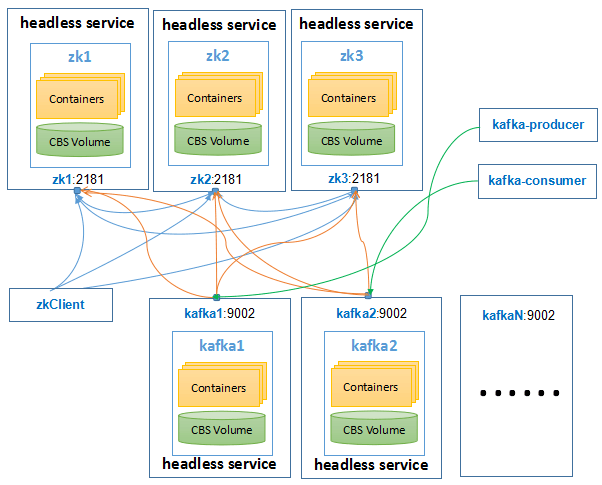

# SMACK

## zookeeper and kafka topology      

## cassandra partition key   
Partition key is hashed by the partitioner to determine which node in the cluster will store the partition.    
In the pic, H01033638 is hashed to -7456322128261119046, so that it is located in a position in the cluster(vnode) ring, then go clockwise, and we will 
see the first cluster(vnode) -4611686018427387904, so the data with home_id H01033638 will be stored in the cluster(vnode) -4611686018427387904.

