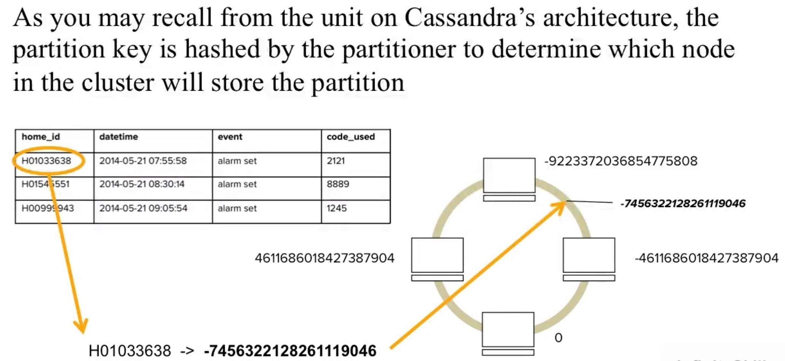

# cassandra  

## experience  
prefer to use docker


## partition key   
Partition key is hashed by the partitioner to determine which node in the cluster will store the partition.    
In the pic, H01033638 is hashed to -7456322128261119046, so that it is located in a position in the cluster(vnode) ring, then go clockwise, and we will 
see the first cluster(vnode) -4611686018427387904, so the data with home_id H01033638 will be stored in the cluster(vnode) -4611686018427387904.



in the following example, the partition key is the PRIMARY KEY definition--the value before the first comma. so in the example, the partition key is home_id
```sql
CREATE TABLE activity(
home_id text,
datetime timestamp,
event text,
code_used text,
PRIMARY KEY (home_id, datetime)
) WITH CLUSTERING ORDER BY (datetime DESC);
```

partiton key = RowKey

## joins does not exist in Cassandra   
The fact that joins do not exist in Cassandra is perphaps the most significant data modeling difference between a distributed database versus a relational database.
**The data for a table in a distributed database is spreaded across the nodes in the cluster based on the token values generated from the partition keys. It could be incredably slow for a cluster to join across multiple tables**


## virtual nodes, or vnodes. 

There are 256 vnodes per server by default.

A vnode is essentially the storage layer.

machine: a physical server, EC2 instance, etc.
server: an installation of Cassandra. Each machine has one installation of Cassandra. The Cassandra server runs core processes such as the snitch, the partitioner, etc.
vnode: The storage layer in a Cassandra server. There are 256 vnodes per server by default.

## what is Snitch  

For example, PropertyFileSnitch  

format: 
```
ip = dataCenterNumber:RACNumber
```

The following PropertyFileSnitch shows 6 nodes in datacenter1 and 4 nodes in datacenter2 
```
130.77.100.147 = DC1:RAC1
130.77.100.148 = DC1:RAC1
130.77.100.165 = DC1:RAC1
130.77.100.109 = DC1:RAC2
130.77.100.110 = DC1:RAC2
130.77.100.111 = DC1:RAC2

155.23.100.128 = DC2:RAC1
155.23.100.129 = DC2:RAC1
155.23.200.107 = DC2:RAC2
155.23.200.108 = DC2:RAC2
```
so that one node knows the topology of the cluster

## Rack   
```
Rack is a logical set of nodes
```

## Gossip  
```
Gossip is a peer-to-peer communication protocol in which nodes periodically exchange state information about themselves and about other nodes they know about. The gossip process runs every second and exchanges state messages with up to three other nodes in the cluster. The nodes exchange information about themselves and about the other nodes that they have gossiped about, so all nodes quickly learn about all other nodes in the cluster. A gossip message has a version associated with it, so that during a gossip exchange, older information is overwritten with the most current state for a particular node.

```

## murmur

```
The Murmur3Partitioner is the default partitioner. The Murmur3Partitioner provides faster hashing and improved performance than the RandomPartitioner. The Murmur3Partitioner can be used with vnodes. However, if you don't use vnodes, you must calculate the tokens, as described in Generating tokens.

```


## replication

```

```

## virtual nodes

```
Virtual nodes, known as Vnodes, distribute data across nodes at a finer granularity than can be easily achieved if calculated tokens are used. Vnodes simplify many tasks in Cassandra:

```


