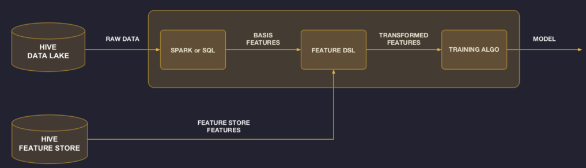
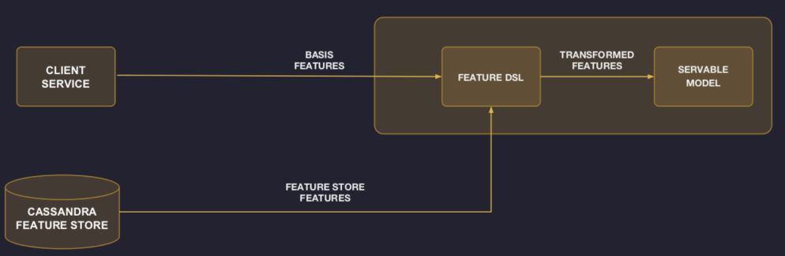
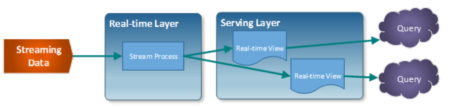

# feature store   

```
Made up of precomputed features, feature stores create highly curated data to feed into machine learning algorithms — so they represent the computed end of the Data Lake.

Feature stores enable highly curated data and consistent training data sets for machine learning. This offers full traceability from data source to final outcome.
```

```
Feature Store (aka Palette)
Problem
• Hardest part of ML is finding good features
• Same features are often used by different models built by different teams

Solution
• Centralized feature store for collecting and sharing features
• Platform team curates core set of widely applicable features
• Modelers contribute more features as part of ongoing model building
• Meta-data for each feature to track ownership, how computed, where used, etc
• Modelers select features by name & join key. Offline & online pipelines autoconfigured
```

## pipeline For Offline Training With Feature Store   




## Pipeline For Online Serving With Feature Store   




## serving layer   

serving layer means real-time view




